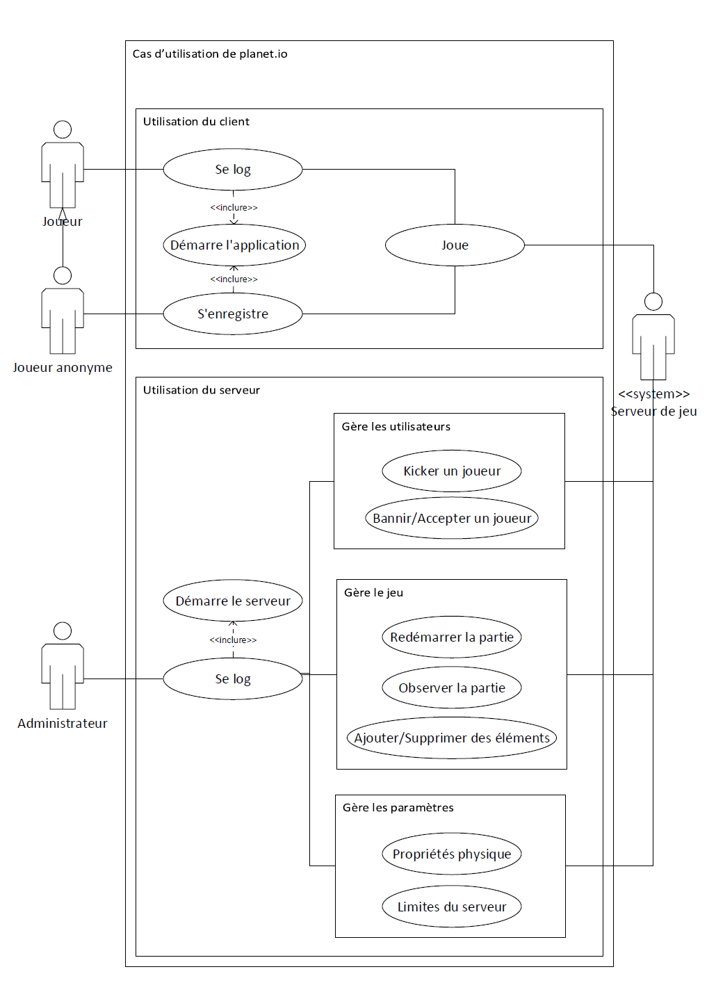

# planet.io
Lucas ELISEI, Pierre-Benjamin MONACO, Gaëtan OTHENIN-GIRARD & David TRUAN

## Description

L'application se présente sous la forme de plusieurs clients et d'un serveur. Chaque client se connecte au serveur, renseigne un pseudonyme et commence à jouer.

Un client contrôle une planète. Celle-ci peut se déplacer dans l'univers. Chaque planète génère une force gravitationnelle qui attire les corps célestes environnants vers elle.
Lorsqu'il y a collision entre deux corps, il y a plusieurs cas de figure :

  - le corps le plus imposant *mange* l'autre et grossit (ce qui amplifie son attraction).
  - les deux corps on une masse trop proche, le plus gros mange le plus petit et finalement explose en fragments.
  - Le corps à tellement mangé sur une courte période qu'il se transforme en soleil / trou noir / autre.

En plus des planètes, des bonus se baladent dans l'univers. Ceux-ci octroient des bonus ou des malus. La liste des possibilités est disponible plus bas.

## Fonctionnalités

1. Déplacement de la planète grâce à la souris: lorsque le joueur fait un geste de frottement à l'aide de sa souris, cela génère une forte gravité par rapport à la planète du joueur (*idée*: attire **tout** sauf les planètes des autres joueurs).

2. Score se basant sur la masse de la planète du joueur. Mise à jour en temps réel du score de chaque joueur, visible par chaque joueur.

3. Sauvegarde des scores des joueurs dans une base de données.

4. Bonus/malus: Des objets célestes qui octroient des bonus ou des malus comme:

    - Un anneau protecteur [bonus, temporaire]
    - Amplification de la masse de la planète [bonus, temporaire]
    - Zone de pluie de météorites [zone malus, temporaire]
    - Mode immortel avec contrôle total sur la trajectoire
    - Planète en feu
    - Planète dans un espace/temps local plus dense (ralentissement)

5. Contrôle du jeu

    - Déplacement au moyen d'un frottement du curseur sur la surface autour de la planète .
    - Zoom/De-zoom avec les touches `+` et `-` .
    - Déplacement de la caméra avec les flèches directionnelles.
    - (Optionnel) perte volontaire de masse.

6. Administration. Au niveau du serveur, un administrateur doit pouvoir effectuer certaines tâches :

    - Kicker / Bannir certains joueurs
    - Vider la base de données (reset des scores par utilisateur ou pour tout le monde)
    - Contrôler les paramètres de l'univers (Gravité, fragmentation, fusion, masse critique pour soleil/trou noir, albedo, life ratio).
    - Prendre le contrôle d'un joueur et modifier son état actuel (attributs du corps du joueur).

7. Fonctionnalités obligatoires

    - Affichage des planètes avec texture (relative au type de corps par exemple).
    - Sons pour chaque actions. Les sons seraient audibles uniquement aux alentours de la planète contrôlée.
    - Effets pour actions : explosions, fusions, radiations, feu/brulures, transformations.
    - Gestion concurrente du maximum de joueurs possibles (si possible, pas de limite).
    - Température des corps, radiations, perte de masse sur le temps.
    - Transformation des corps, ex : passage de planète à soleil, de soleil à trou noir.

8. Fonctionnalités optionnelles

    - Composition atomique du corps (% de chaque éléments fondamentaux : Fe, C, O, He, H, N, U, etc..) --> permettrait de définir la densité.
    - Variation de la densité en fonction de la composition et de la force G appliquée à soi-même. Une planète de masse *m* sera logiquement toujours moins dense qu'une planète de masse *m+1* car la masse va augmenter la force de gravité et donc la "compression" de la planète sur elle-même.
    - Vie sur les planètes (en fonction de la chaleur et du taux de radiations --> zones de vie autour des soleils).
    - Nouveau corps : Nuages de gaz, comètes, spécialisation des planètes (gazeuse, rocheuse, océanique, magmatique, plasmatique, etc... )
    - Management du serveur depuis `telnet`.

## Règles du jeu

* Pas de victoire.
* Système de classement selon des points.
* Si deux planètes se touchent, celles-ci explosent ou alors une mange l'autre (dépend de la densité des planètes).
* ?

## Contraintes

### Flux réseau
Dans un cadre d'application client-serveur, la contrainte principale est le flux réseau. Nous allons donc partir du principe que le minimum de données doivent transiter sur le réseau. Seules les informations relatives à la position et aux attributs des planètes seront envoyés depuis le serveur. Seules les données relatives à la position de la "caméra" et la souris du client seront envoyées au serveur. Pour aller plus loin, il faudrait envoyer les données concernant uniquement les éléments à être affichés par le client (et ignorer les élément périphériques).

### Contraintes client
Le client quant à lui doit pouvoir démarrer sans serveur actif, indiquer à l'utilisateur qu'aucun serveur n'est connecté. Après démarrage du serveur le programme doit détecter automatiquement que le serveur est UP et se connecter. Lors d'une première connexion, l'utilisateur doit pouvoir s'enregistrer au près du serveur.

### Contraintes serveur
Le serveur doit être administrable. Lors de la première utilisation, l'admin doit pouvoir définir un nom et un mot de passe.  
Des données persistantes seront aussi stockées sur le serveur. Celles-ci sont composées de:

* Score des joueurs
* Identifiants de connexion des joueurs
* ?

### Valeurs limites
Dans le cadre d'une simulation d'un modèle physique, les valeurs limites sont importantes. En effet, pour un modèle d'univers, les grandeurs sont astronomiques (c'est le cas de le dire!). Il faudra donc faire très attention aux chiffres significatifs de chaque grandeur physique afin que les calculs ne dépassent pas les plages de valeurs des variables.

## Priorités de développement

1. Définir une interface graphique ergonomique et agréable.
2. Etablir une connexion stable (sans interruption) entre le serveur et les clients.
3. Implémenter les interactions entre les différents éléments du système dans un souci de fluidité.
4. Rendre un produit fonctionnel, répondant aux fonctionnalités (obligatoire) définies au préalable.
5. Toujours développer dans un souci d'évolutivité afin de pouvoir facilement rajouter des fonctionnalités.

## Schéma des cas d'utilisation

