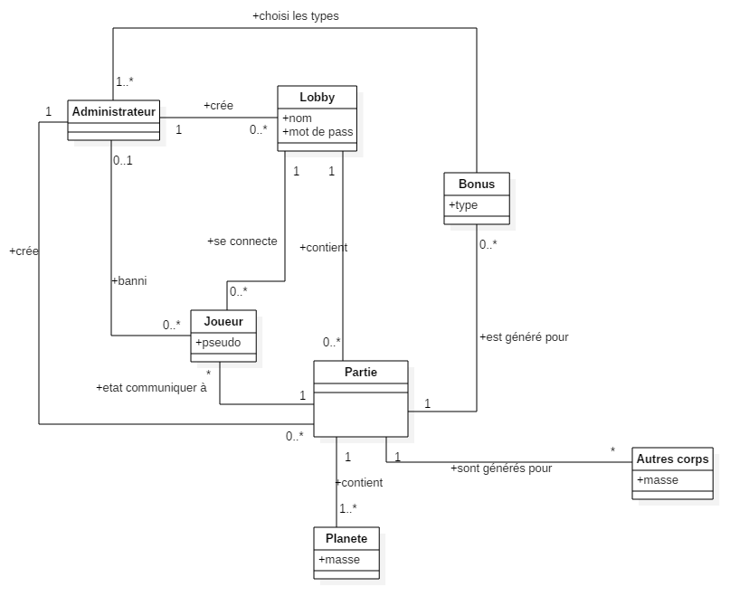

# planet.io
Etudiants : Lucas ELISEI, Pierre-Benjamin MONACO, Gaëtan OTHENIN-GIRARD & David TRUAN  
Professeur : Eric Lefrançois  
Assistant : Christophe Greppin  

## Description

L'application se présente sous la forme de plusieurs clients et d'un serveur. Chaque client se connecte au serveur, renseigne un pseudonyme et commence à jouer.

Un client contrôle une planète. Celle-ci peut se déplacer dans l'univers. Chaque planète génère une force gravitationnelle qui attire les corps célestes environnants vers elle.
Lorsqu'il y a collision entre deux corps, il y a plusieurs cas de figure :

  - le corps le plus imposant *mange* l'autre et grossit (ce qui amplifie son attraction).
  - les deux corps on une masse trop proche, le plus gros mange le plus petit et finalement explose en fragments.
  - Le corps à tellement mangé sur une courte période qu'il se transforme en soleil / trou noir / autre.

En plus des planètes, des bonus se baladent dans l'univers. Ceux-ci octroient des bonus ou des malus. La liste des possibilités est disponible plus bas.

## Fonctionnalités

1. Déplacement de la planète grâce à la souris: lorsque le joueur fait un geste de frottement à l'aide de sa souris, cela génère une forte gravité par rapport à la planète du joueur (*idée*: attire **tout** sauf les planètes des autres joueurs).

2. Score se basant sur la masse de la planète du joueur. Mise à jour en temps réel du score de chaque joueur, visible par chaque joueur.

3. Sauvegarde des scores des joueurs dans une base de données.

4. Bonus/malus: Des objets célestes qui octroient des bonus ou des malus comme:

    - Un anneau protecteur [bonus, temporaire]
    - Amplification de la masse de la planète [bonus, temporaire]
    - Zone de pluie de météorites [zone malus, temporaire]
    - Mode immortel avec contrôle total sur la trajectoire
    - Planète en feu
    - Planète dans un espace/temps local plus dense (ralentissement)

5. Contrôle du jeu

    - Déplacement au moyen d'un frottement du curseur sur la surface autour de la planète .
    - Zoom/De-zoom avec les touches `+` et `-` .
    - Déplacement de la caméra avec les flèches directionnelles.
    - (Optionnel) perte volontaire de masse.

6. Administration. Au niveau du serveur, un administrateur doit pouvoir effectuer certaines tâches :

    - Kicker / Bannir certains joueurs
    - Vider la base de données (reset des scores par utilisateur ou pour tout le monde)
    - Contrôler les paramètres de l'univers (Gravité, fragmentation, fusion, masse critique pour soleil/trou noir, albedo, life ratio).
    - Prendre le contrôle d'un joueur et modifier son état actuel (attributs du corps du joueur).

7. Fonctionnalités obligatoires

    - Affichage des planètes avec texture (relative au type de corps par exemple).
    - Sons pour chaque actions. Les sons seraient audibles uniquement aux alentours de la planète contrôlée.
    - Effets pour actions : explosions, fusions, radiations, feu/brulures, transformations.
    - Gestion concurrente du maximum de joueurs possibles (si possible, pas de limite).
    - Température des corps, radiations, perte de masse sur le temps.
    - Transformation des corps, ex : passage de planète à soleil, de soleil à trou noir.

8. Fonctionnalités optionnelles

    - Composition atomique du corps (% de chaque éléments fondamentaux : Fe, C, O, He, H, N, U, etc..) --> permettrait de définir la densité.
    - Variation de la densité en fonction de la composition et de la force G appliquée à soi-même. Une planète de masse *m* sera logiquement toujours moins dense qu'une planète de masse *m+1* car la masse va augmenter la force de gravité et donc la "compression" de la planète sur elle-même.
    - Vie sur les planètes (en fonction de la chaleur et du taux de radiations --> zones de vie autour des soleils).
    - Nouveau corps : Nuages de gaz, comètes, spécialisation des planètes (gazeuse, rocheuse, océanique, magmatique, plasmatique, etc... )
    - Management du serveur depuis `telnet`.

## Règles du jeu

* Pas de victoire.
* Système de classement selon des points.
* Si deux planètes se touchent, celles-ci explosent ou alors une mange l'autre (dépend de la densité des planètes).
* ?

## Contraintes

### Flux réseau
Dans un cadre d'application client-serveur, la contrainte principale est le flux réseau. Nous allons donc partir du principe que le minimum de données doivent transiter sur le réseau. Seules les informations relatives à la position et aux attributs des planètes seront envoyés depuis le serveur. Seules les données relatives à la position de la "caméra" et la souris du client seront envoyées au serveur. Pour aller plus loin, il faudrait envoyer les données concernant uniquement les éléments à être affichés par le client (et ignorer les élément périphériques).

### Contraintes client
Le client quant à lui doit pouvoir démarrer sans serveur actif, indiquer à l'utilisateur qu'aucun serveur n'est connecté. Après démarrage du serveur le programme doit détecter automatiquement que le serveur est UP et se connecter. Lors d'une première connexion, l'utilisateur doit pouvoir s'enregistrer au près du serveur.

### Contraintes serveur
Le serveur doit être administrable. Lors de la première utilisation, l'admin doit pouvoir définir un nom et un mot de passe.  
Des données persistantes seront aussi stockées sur le serveur. Celles-ci sont composées de:

* Score des joueurs
* Identifiants de connexion des joueurs
* ?

### Valeurs limites
Dans le cadre d'une simulation d'un modèle physique, les valeurs limites sont importantes. En effet, pour un modèle d'univers, les grandeurs sont astronomiques (c'est le cas de le dire!). Il faudra donc faire très attention aux chiffres significatifs de chaque grandeur physique afin que les calculs ne dépassent pas les plages de valeurs des variables.

## Priorités de développement

1. Définir une interface graphique ergonomique et agréable.
2. Etablir une connexion stable (sans interruption) entre le serveur et les clients.
3. Implémenter les interactions entre les différents éléments du système dans un souci de fluidité.
4. Rendre un produit fonctionnel, répondant aux fonctionnalités (obligatoire) définies au préalable.
5. Toujours développer dans un souci d'évolutivité afin de pouvoir facilement rajouter des fonctionnalités.

## Schéma des cas d'utilisation

## Base de données
La base de données va principalement nous servir à stocker les comptes utilisateurs et les différentes parties jouées. Chaque partie sera sauvegardée et comprendra un classement.
Chaque joueur possédera une compte composé d’un pseudo et d’un mot de passe. Son meilleur score sera aussi associé à son compte. Il aura la possibilité de voir toutes les parties auquelles il a participé et son score à chacune d’elle.
Un deuxième type de compte sera le compte « modérateur ». Les modérateurs seront des arbitres ayant des droits administrateurs sur la partie. Ils auront un compte comme les utilisateurs mais ne posséderont pas de meilleur score. Un historique des parties modérées sera aussi mis à leur disposition.

## Schéma conceptuel de la BDD

## Protocole d'échange entre le client et le serveur

Chaque donnée envoyée ou reçue sera sous la forme JSON.

Commande | Description
:-----------------: | ----------------------------------------
`PLANET_IO_SUCCESS:<data_nullable>` | Demande acceptée avec possibilité de retourner des données
`PLANET_IO_FAILURE:<error>` | Demande refusée avec description de l'erreur
`PLANET_IO_HELLO` | Demande de connexion au serveur
`PLANET_IO_LOGIN:<credentials>` | Demande de connexion à un compte
`PLANET_IO_REGISTER:<credentials>` | Demande de création de compte
`PLANET_IO_GET_SCORES` | Demande de récupération des scores
`PLANET_IO_GET_UNIVERSE` | Demande des données relatives à l'univers
`PLANET_IO_SEND_POSITION:<position_data>` | Envoi de la position de la planète au serveur

## Schéma de domaine  

### Client
  

### Server
  

## Plan d'itérations

### Itération 1

#### Objectifs

Modelisation des schémas UML du client et serveur et prototype :  

 - Schéma UML du client.
 - Schéma UML du serveur.
 - Schéma UML des modules externes.
 - Création d'un prototype simple de client.
 
#### Temps escompté

 - une semaine (plus les vacances de pâques).
 
#### Rôles et effort escompté

 - Chef de projet / Responsable des normes et procédures / Resposable des tests (P-B. Monaco) : Mise en place de JUnit et implémentation des test du prototype, 2h.
 - Achitecte, concepteur en chef / Programmeur (Lucas Elisei) : Développement du schéma UML du server,2h.
 - Représentant des utilisateurs / Programmeur (David Truan) : Développement du schéma UML du client, 2h.
 - Resposable de la configuration / Programmeur (Gaétan Othenin-Girard) : Mise en place du projet Maven, du système de contrôle de version et mise en place du système d'intégration continue, 2h.
 - Tout le monde : Développement du prototype (travail collaboratif : bonne technique pour être opérationnel avec git le moment venu).

### Itération 2

#### Objectifs

Système de jeu fonctionnel en standalone :  

 - création partie.
 - contrôle d'une planete.
 - gestion des événements (collisions, changements d'états).
 - design graphique (simple).

#### Temps escompté

 - une semaine

#### Rôles et effort escompté

 - Chef de projet / Responsable des normes et procédures / Resposable des tests (P-B. Monaco) : Test unitaires et revue de code, 4h.
 - Achitecte, concepteur en chef / Programmeur (Lucas Elisei) : Gestion des propriétés physiques, 6h.
 - Représentant des utilisateurs / Programmeur (David Truan) : Design graphique, validation du design auprès d'utilisateurs Alpha, 5h.
 - Resposable de la configuration / Programmeur (Gaétan Othenin-Girard) : Gestion événementielle, 6h.

### Itération 3

#### Objectifs
L'objectif de cette itération est l'amélioration de l'application crée lors de la première itération mais en fonctionnant de manière client/serveur. Sur cette version, le serveur contiendra les informations concernant les objets du jeu qu'il enverra au client. Le client va uniquement afficher les objets aux coordonnées reçues.

#### Temps escompté
Une semaine.

#### Rôles et efforts escomptés
- Responsable de projet (P-B. Monaco): Tests unitaires et revue de code, 2h.
- Architecte, concepteur en chef (Lucas Elisei) : Conception et implémentation de l'API, 3h.
- Représentant des utilisateurs (David Truan) : Interface client générale (différentes zones du GUI), 3h.
- Responsable de configuration (Gaëtan Othenin-Girard) : Création et gestion de la connexion au serveur, 3h.

### Itération 4

#### Objectifs
Implémentation du concept de joueurs avec la création de comptes stockés dans la base de données et connexion au serveur via l'interface du client.

#### Temps escompté
- Une semaine.

#### Rôles et efforts escomptés
- Responsable de projet (P-B. Monaco): Création de la base de données et ajout de la partie compte utilisateur, 3h.
- Architecte, concepteur en chef (Lucas Elisei) : Connexion à la base de données et affichage du pseudo sur la planète. 3h.
- Représentant des utilisateurs (David Truan) : Analyse et recherche des besoins au niveau sécuritaire et tests unitaires, 2h.
- Responsable de configuration (Gaëtan Othenin-Girard) : Interface de connexion au compte utilisateur sur le client, 4h.

### Itération 5

#### Objectifs

Management du serveur :
 - Implémentation du système de de score.
 - Etude des échanges entre client et serveur (adaptation de la taille et du type de données partagées).
 - Etude des flux entre les threads du serveur et optimisation.
 - Tests unitiares de l'interraction client/serveur.

#### Temps escompté

 - une semaine

#### Rôles et effort escompté

 - Chef de projet / Responsable des normes et procédures (P-B. Monaco) / Programmeur : Implémentation des scores dans l'application, 3h.
 - Achitecte, concepteur en chef / Responsable des tests (Lucas Elisei) : Tests unitaires, test de fonctionnnement et revue de code, 4h.
 - Représentant des utilisateurs / Programmeur (David Truan) : Etude et optimisation des flux entre client et serveur, validation auprès des utilisateurs alpha.
 - Resposable de la configuration / Programmeur (Gaétan Othenin-Girard) : Implémentation du système de score dans la base de donnée, 3h.

### Itération 6

#### Objectifs

Management du serveur :
 - Implémentation des fonctions de contrôle des joueur (ban kick, allow, etc..:).
 - Essais d'attaques depuis le client, vérification qu'il n'est pas possible de contrer un bannisement.
 - Etudes des différentes techniques de triches qui pourraient être utilisée (glitches et exploit).

#### Temps escompté

 - une semaine

#### Rôles et effort escompté

 - Chef de projet / Responsable des normes et procédures (P-B. Monaco) / Programmeur : Implémentation des fonctions d'administration, 3h.
 - Achitecte, concepteur en chef / Programmeur (Lucas Elisei) : Etude des problèmees/risques de sécurité. Ecriture d'un rapport de sécurité, 3h.
 - Représentant des utilisateurs / Programmeur (David Truan) : Etude des problèmees/risques de sécurité. Ecriture d'un rapport de sécurité, 3h.
 - Responsable de la configuration / Responsable des tests (Gaétan Othenin-Girard) : Test unitaires, vérification et validation du fonctionnement et revue de code, 2h.

### Itération 7

#### Objectifs
Implémentation des modifications administrateurs en pleine partie avec l'ajout de compte "modérateur". Par exemple :
- Ajout de bonus à un endroit.
- Explosion d'une planète sélectionnée.
- Application instantanée d'un bonus sur un joueur.
- Déplacement d'un joueur en drag and drop.
- Mettre la partie en pause.

#### Temps escompté
- Une semaine.

#### Rôles et efforts escomptés
- Responsable de projet (P-B. Monaco): Apparition d'objets aux endroits sélectionnés et tests unitaires, 3h.
- Architecte, concepteur en chef (Lucas Elisei) : Implémentation du compte spécial "modérateur" sur la base de données et en jeu, 3h.
- Représentant des utilisateurs (David Truan) : Interraction directe avec la planète du joueur (déplacement et explosion), 3h.
- Responsable de configuration (Gaëtan Othenin-Girard) : Interface de sélection de la liste des joueurs et ajout de bonus sur le joueur sélectionné, 3h.

### Itération 8

#### Objectifs
- Finalisation du projet, récupération du retard.

#### Temps escompté
- Une semaine.

#### Rôles et efforts escomptés
- Responsable de projet (P-B. Monaco): Finalisation, revue de code en profondeur, 2h.
- Architecte, concepteur en chef (Lucas Elisei) : Finalisation, revue de code en profondeur, 2h.
- Représentant des utilisateurs (David Truan) : Finalisation, revue de code en profondeur, 2h.
- Responsable de configuration (Gaëtan Othenin-Girard) : Finalisation, revue de code en profondeur, 2h.
